# Video	Processing Project

## Introduction

The objective of this project was to create an algorithm designed to stabilize input videos, separate foreground and background elements, replace the background, and accurately track moving foreground objects across consecutive frames.
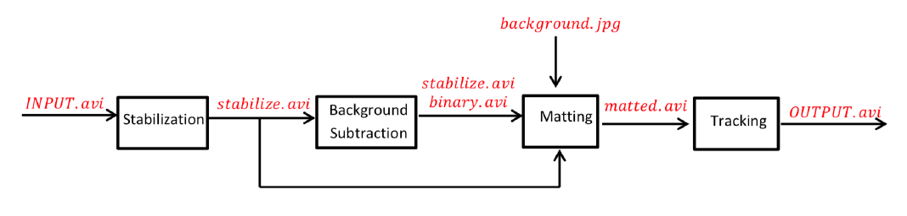

## 1 Video Stabilization

Function:	 **VidStabilization(inVid)**

Input:

- Original	Video:	INPUT.avi

Output:

- Stabilized	Video:	stabilized.avi

Algorithm:

This	function	uses	feature	points	from	2	consecutive	frames.	The	feature	points	for	each	frame	
are	calculated	by	CV2’s	 **goodFeaturesToTrack** function	which	finds	the	most	prominent	corners.	Then,	
it	uses	CV2’s	 **calcOpticalFlowPyrLK** which	calculates	the	optical	flow	for	the	feature	point	using	image	
pyramids	with	different	resolution.	Out	of	all	feature	points	we	choose	4	points	to	construct	the	affine	
transformation	 matrix	 between	 the	 two	 2D	 points	 set	 **estimateRigidTransform.	** The	 selection	 of	 4	
points	is	done	by	 **transformMatrixRANSAC** which	uses	the	Random	sample	consensus	principle	to	find	
the	4	points	which	most	of	the	data	set	agree	with	the	transform	matrix	they	produce.	The	user	can	
set	as	input	the	maximum	error	of	a	transferred	point	to	be	considered	an	inlier	(MAX_ERROR)	and	
the	required	inliers	percent	(PERCENT)	the probability	for	a point	to	be	an	inlier	was	set	to	0.99.	Once	
we	 have	 the	 agreed	 upon	 rigid	 (Euclidean)	 transformation	 matrix,	 we	 decompose	it	 into	 x	 and	 y	
translation	and	rotation	(angle).	We	store	these	values	in	an	array	for	all	pairs	of	consecutive	frames.	
When	 we	 have	 all	 the	 transformation	 values	 for	 each	frame, we	 build	 a	 trajectory	 of	 all	
transformations	over	the	length	of	the	video and	we	smooth	it	using	a	moving	average	filter	which	
smooths	the	transition	between	transfer	functions,	the	 **SMOOTHING_RADIUS** determines	the	filter	

size.	Finally, when	 we	 have	 the	modified	 angle	 and	 translation	 values,	 we	 reconstruct	 the	 rigid	
transform	matrixes	and	use	CV2’s	 **warpAffine** to	warp	all	frames	and	create	the	stabilized	video.

## 2 Background	Subtraction

The	background	subtraction	is	divided into	two	main	functions:	Binary()	computing	the	binary	
video	and	extraction()	computing	the	binary	filtered	video.	

**2.1 Binary	Video**
Function:	 **Binary(inVid)**

Input:

- Stabilized Video:	stabilized.avi

Output:

- Binary Video:	binary.avi
Algorithm:

This	function	receives	as	input	the	stabilized	movie	and	creates	a	binary	video	of	the	extracted	
foreground. At	first,	we	implemented	a	temporal	median	filter	and	tried	different	thresholds	to	extract			
the	 foreground	 pixels,	 but	 this	 method	 produced	 a	 very	 noisy	 foreground	 even	 after	 using	 special	
median	filtering.	Next	we	tried	using	GMM	for	background	subtraction	which	is a	gaussian	mixture	
model Background\Foreground	 segmentation	 algorithm.	 We	 used	 CV2’s	
**createBackgroundSubtractorMOG** which	model	each	pixel	by	a	mixture	of	gaussian	distributions	and	
the	weights	of	each	gaussian	in	a	specific	pixel	is	a	function	of	the	time	duration	of	the	colors	in	that	
pixels	stay	in	video.	The	background	colors	are	then	distinguished	on	the	principle	that	they	stay	longer	
and	more	static.	once	we	know	which	colors	they	are,	we	can	flag	a	pixel	as	background	if	it’s	weight	
for	background	color	gaussian	in	prominent this	method	produced	overall	much	better	results.	

different methods were tested ultimately, CV2’s	object	 **createBackgroundSubtractorKNN** which	is	a	pixel	level	background	subtraction algorithm similar	 to	 MOG	 that	 uses	 Euclidean	 distance	 for	 clustering. These	 methods	 update	 the	
clusters	 with	 each	 frame	 so	 some	 of	 first	 frames	 don’t	 produce	 the	 best	 results so	 we	decided	to	
discard	them. We	then	proceed	to	use	spatial	median	filter	to	clean	the	binary	frame	from	outlier	pixel	
using	the	input	value	 **MEDIAN_SIZE.	** Since	the	camera	moved	a	little	too	much,	the	edge	of	the	floor	
with	 the	 wall	 was	 still	 present	 in	 the	 binary	 frame.	 In	 order	 to	 “clean	 it”	 we	 subtract	the	gradient	then	adds	it	back	in	order	not	to	modify	the	binary	image	of	the	person	but	
subtracts	the	edges.

**2.2 Extraction**
Input:

- Stabilized	Video:	stabilized.avi
- Binary	Video:	binary.avi

Output:

- Extracted	person’s Video:	extracted.avi
Algorithm:

This	algorithm simply	applies	the	binary	frames	as	masks	on	each	stabilized	frame	using	
OpenCV’s	function:	cv2.bitwise_and(Frame,	BinaryFrame)

Results:

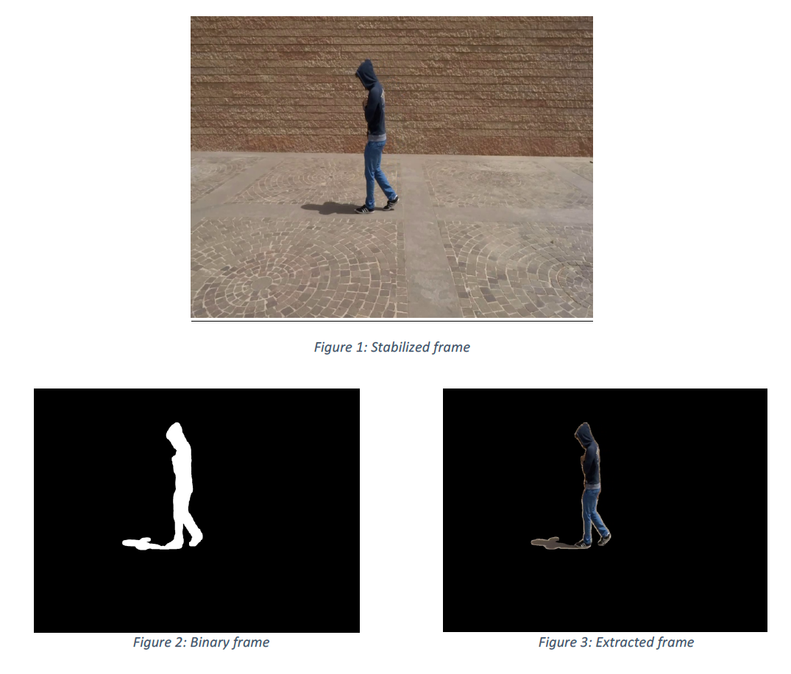

## 3 Matting
**3.1 Probability	estimation	of	Foreground	and	Background	(For	all	video)**
In	order	to	do	so	we	implemented	two	functions.	One	computes	the	likelihood	based	on	the	
first	 frame.	 The	 other	 one	 computes	 it	 on	 several	 frames	 at	 a	 certain	 frequency. The	 function	
computing	the	likelihoods	on	the	a	few	frames	gives	slightly	better	results	in	our	case.	
Function: **FG_BG_likelihood_all_vid(StabilizedVid,	BinaryVid,	frameInterval=20)**
Input:

- Stabilized	Video:	stabilized.avi
- Binary	Video:	binary.avi
- Frame	 interval:	 parameter	 representing	 the	 interval	 of	 frames	 we	 take	 into	 account	 to	
    compute	the	likelihoods.	

Output:

- Extracted	 person’s Video:	Foreground	 and	 background	 intensity	 likelihood	 functions (on	 V	
    channel	of	the	HSV	converted	frames)

Algorithm:

The likelihood	functions	of	the	Foreground	and	background	are	computed	using	the	binary	
video	and	the	stabilized	video.	The	binary	filter	allows	us	to	select	randomly	1000	scribble points	
from	the	foregrounds	and	the	backgrounds	of	each	considered	frames.	Then,	using	Scipy’s	KDE
function,	the	likelihood	functions	are	computed.

Results:
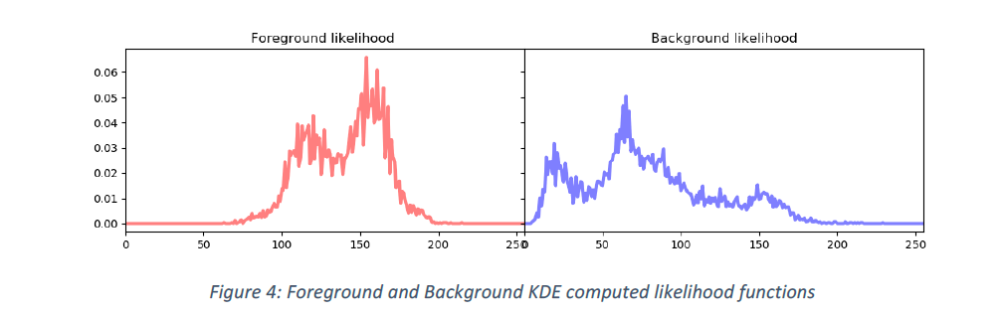

**3.2 Matting	main	function	**
Once	the	likelihood	functions	have	been	computed,	the	matting	main	function	will	operate	
the	matting	on	each	frame	separately.

Function:

**ChangeVideoBackground(StabilizedVid,	BinaryVid,	NewBackground,	FGLikelihood,	BGLikelihood)**

Input:

- Stabilized	Video:	stabilized.avi
- Binary	Video:	binary.avi
- NewBackground
- FGLikelihood,	BGLikelihood:	Foreground	and	background	KDE	compute	likelihood	functions.

Output:

- Matted	video:	matted.avi

**_3.2.1 Probability	Maps	and	Gradient	of	likelihood	Maps(For	each	frame)_**
The	second	step,	using	the	likelihood	functions	computed	above,	for	each	frame	a	probability	
map	is	computed.

Function: **FG_BG_Proba_Map(frame,	FGLikelihood,	BGLikelihood)**

Input:

- Frame:	V	channel	of	HSV	converted	frame
- FGLikelihood /	BGLikelihood:	Foreground	and	background	KDE	computed	likelihood	functions

Output:

- Probability	maps	(2	maps)	with	the	probability	of	each	pixel	to	be	Foreground/	Background

Results:

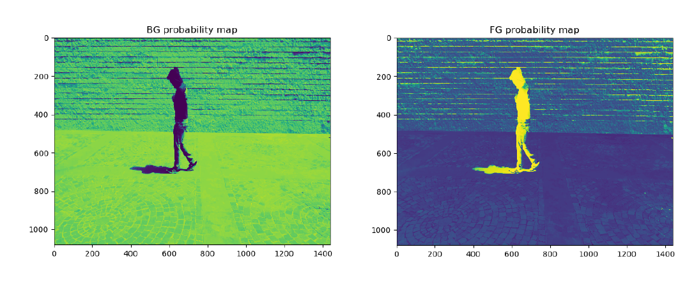

Function: **Gradient_Map(FG_L_Map,	BG_L_Map)**

Input:

- FG_L_Map,	BG_L_Map:	Foreground	and	Background	Likelihood	Maps.

Output:

- Gradient	Maps	of	the	foreground	and	the	background	likelihood	maps.	

Results:

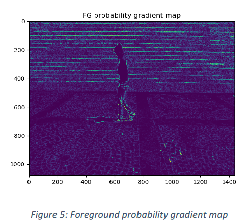

**_3.2.2 Weighted	distance	transform (WDT) (For	each	frame)_**

Function: **Gradient_Map(FG_L_Map,	BG_L_Map)**

Input:

- FG_L_Map,	BG_L_Map:	Foreground	and	Background	Likelihood	Maps.

Output:

- Gradient	Maps	of	the	foreground	and	the	background	likelihood	maps.		

Algorithm:

Once	we	have	the	Probability	map	and	the	binary	video, we	proceed	to	compute	the	weighted	
distance	transform	using	the	provided	code	with	some	adjustments.	First,	we	calculate	the	cost	field	
for	 the	 foreground	 using	 the	 function	 **wdt.map_image_to_costs** which	 converts	 image	 data	 to	 a	
marginal	cost	function,	a	2D	array	containing	costs	for	moving	through	each	pixel; we	modified	the	
function to	 use	 binary	 video	 as	 the	 exits	 so	 that	 the	 function	 computes	 all	 cost	 in	 relation	 to	 the	
foreground.	In	addition,	we	eroded	the	binary	vid	to	make	sure	none	of	the	probability	gradient’s
boundaries	are	set	as	seeding	points. Fpr	computation	efficiency,	we also	used	the	seeding	points	of	
the	 background	 as	 obstacles	 for	 the	 foreground’s	 distance	 map	 to	 reduce	 computation	 cost	 and	
similarly,	the	foregrounds	scribbles	as	obstacles	for	the	background	distance	map.

In	order to	take	full	advantage	of	the	dynamic	range,	so	we	used	histogram	equalization	in	the	cost	
map. Finally,	we used **wdt.get_weighted_distance_transform** to	calculate	the	weighted	distance	map
which	considers	the	distance	from	the	scribble	points	(binary	image)	together	with	the	intensity	of	the	
pixels	along	the	way	from	the	scribble	points	to	compute	a	weighted	distance	value.	The	further	a	
pixel	is	from	the	foreground	and	the	more	boundaries	it	needs to cross,	the	higher	the	cost.

We	then	repeat	the	process	for	the	background	(we	flip	the	values on	the	binary	image	to	use	them	
as	scribble	points	now).

Now	that	we	have	a	weighted	distance	from	both	the	background	and	foreground,	we	can	replace	all	
the	pixels	which	have	smaller	distance	to	from	the	background	with	pixels	from	another	image.

Results:

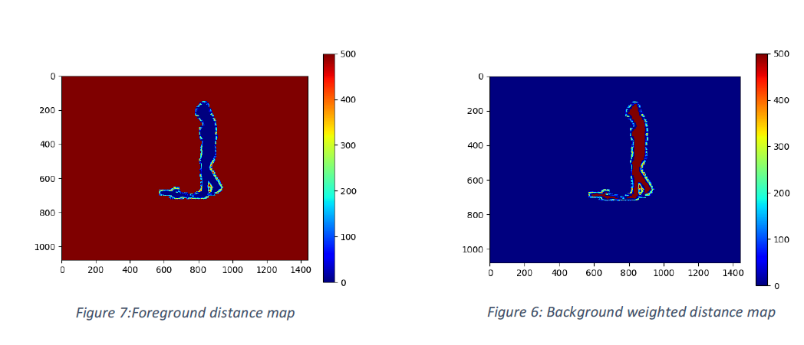

**_3.2.3 Trimap (For	each	frame)_**

Function:	 **TrimapFrame(binaryFrame)**

Input:

- FG_L_Map,	BG_L_Map:	Foreground	and	Background	Likelihood	Maps.
- Distance_transform_FG /	BGForeground	and	background	distance	maps.	

Output:

- Trimap.	(0	Background,	1	Foreground,	3	unknown)	

Algroithm:

Next we	 address	 the	 pixels	 on	 the	 border	 between	 the	 foreground	 and	 the	
background. The	function uses	dilation	to	expand	the	binary	foreground	frame	and	then	computes	
the	outline	of	the	binary	image	by	subtracting	the	binary	frame	from	the	dilated	binary	frame.	No	that	
we	have	the	outline,	we	can	dilate	it	as	much	as	we	want	using	the	input	value	DILATION_SIZE	to	affect	
the	size	of	the	trimap.

Remark:	 At	 first	 we	 implemented	 a	 function	 that	 computed	 the	 trimap	 using	 a	comparison of	 the	
distance	maps	of	FG	and	BG.	However,	the	results	of	the	above	explained	function	were	better.

The	next	stage	was	to	update	the	probability	map	for	the	opacity	map	calculation	and	for	that	we	take	
the	inner	band	of	the	trimap	– the	contour	of	FG	pixels	closest	to	the	“unknown”	zone	of	the	trimap	
and	computed	a	new	KDE.	We	repeat	the	same process	using	the	outer	band	of	pixels	which	belongs
to	the	BG.	With	the	new	KDEs,	we	compute	new	probability	maps	based	on	the	closest	pixels	to	the	
unknown	zone.

**_3.2.4 Alpha	Map (For	each	frame)_**
Function:	

**computeAlphaMap(distance_transform_FG, FG_L_Map, distance_transform_BG, BG_L_Map, r =	2)**

Input:

- FG_L_Map,	BG_L_Map:	Foreground	and	Background	Likelihood	Maps.
- Distance_transform_FG /	BGForeground	and	background	distance	maps.	

Output:

- Alpha	map

Algorithm:

With	the	Trimap,	probability	map	and	weighted	distance	transform	we	can	calculate	the	alpha	
value	for	each	pixel	which	is	essentially	the	weight	of	the	foreground	color	in	the	border	pixels.	To	
compute	the	alpha	map	according	to	formula	seen	in	class:

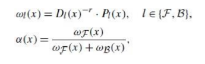

**_3.2.5 Matting (For	each frame)_**

Function:	

**Matting_simple(Stabilized,	NewBackground, Trimap,	AlphaMap, DistMapFG,	DistMapBG)**

Input:
- StabilizedVid:	stabilized.avi
- **Trimap**
- NewBackground:	background.png

Output:

- Matted	Video:	matted.avi

Algorithm:

For	each	pixel	in	the	trimap unknown	zone,	the	color	of	the	pixel	is	computed	by	the	formula:

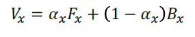

Where:	𝑉_x is	the	color	of	the	output	at	pixel	x,	𝛼_x the	value	of	the	alpha	map	at	pixel	x, 𝐹$ the	color	
of	the	foreground	at	pixel	x,	and	𝐵_x the	color	of	the new	background	at	pixel	x.	

Remark:	an	enhanced	matting	function	that	searches	for	the	optimal	FG	and	BG	
colors	that	blended	in	the	unknown pixel was also tested.	It	looks	at	the	neighboring FG	and	BG	pixels	and	choses
the	colors	that	match	best	the	x	pixel’s	color.	

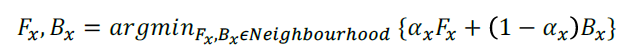

Due to	computational	load	this function was no used but can still be	utilized using the	function	
Matting_Enchanced() in	Matting.py.

**3.3 Results**

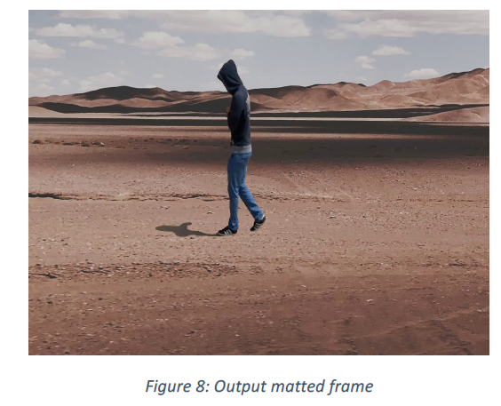

## 4 Tracking:

### 4.1 GUI

In	order	to	start	the	tracking,	we	implement	a	GUI	that	allows	to	select	the	object	to	be	
tracked.	

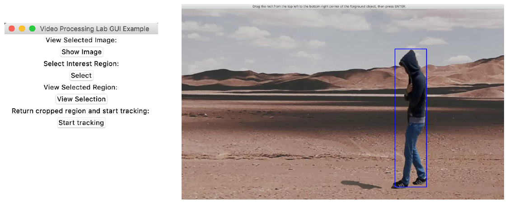

**_4.2 Tracking_**

Function: **Tracking(inVid,	VideoParameters):**

Input:

- inVid:	Matted	Video
- VideoParameters:	including	the	initial	particle	as	well	as	the	covariance	matrix

Output:	

- OUTPUT.avi:	Matted	video	with	rectangle	around	the	tracked	person.	
    § Red	rectangle	=>	Maximum	weight	particle	
    § Green	rectangle	=>	Mean	of	particles

Algorithm:

The	 tracking	 algorithm	 is	 an implementation of a	particle	 filter’s	 condensation	 algorithm. Each	frame,	the	particles	are	sampled	based	on	their	weight,	
drifted,	and	weighted	following	the	Bhattacharyya	distance	with	the	histogram	of	reference	of	the	
object.	

Results:

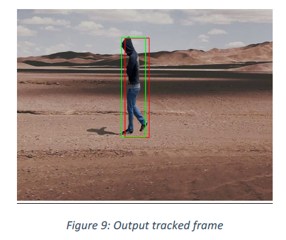

## Project Structure
- BackgroundSubtraction.py
- GUI_tracking.py
- Matting.py
- Stabilization.py
- Tracking.py
- wdt.py (weighted distance transform)
- Main.py (Run the entire pipeline)
- runme.py (Run each block in the pipeline separately for testing purposes)

The input video and image are 

